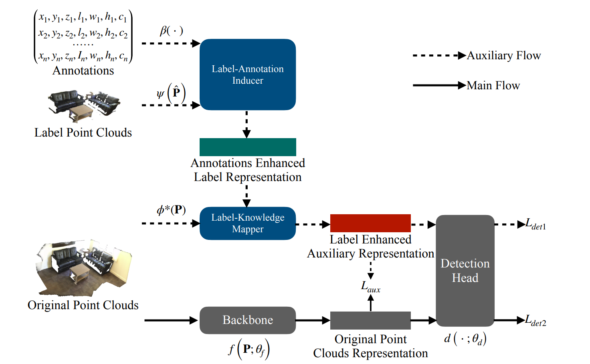

# Label-Guided Auxiliary Training Improves 3D Object Detector

This is the official implementation of LG3D (ECCV 2022), a simple and highly efficient auxiliary network for 3D object detection. For more details, please refer to:

**Label-Guided Auxiliary Training Improves 3D Object Detector**



## Introduction

In this
paper, we propose a Label-Guided auxiliary training method for 3D object detection (LG3D in short), which serves as an auxiliary network to enhance the feature learning of existing 3D object detectors.

## Citation

If you find our work useful in your research, please consider citing:

```
@inproceedings{huang2022label,
  title={Label-guided auxiliary training improves 3d object detector},
  author={Huang, Yaomin and Liu, Xinmei and Zhu, Yichen and Xu, Zhiyuan and Shen, Chaomin and Che, Zhengping and Zhang, Guixu and Peng, Yaxin and Feng, Feifei and Tang, Jian},
  booktitle={Computer Vision--ECCV 2022: 17th European Conference, Tel Aviv, Israel, October 23--27, 2022, Proceedings, Part IX},
  pages={684--700},
  year={2022},
  organization={Springer}
}
```

## Installation

This repo is built based on [mmdetection3d](https://github.com/open-mmlab/mmdetection3d) (V1.0.0), please follow the [getting_started.md](https://github.com/open-mmlab/mmdetection3d/blob/master/docs/en/getting_started.md) for installation.

The code is tested under the following environment:

- Ubuntu 18.04 LTS
- Python 3.7.16
- Pytorch 1.6.0
- CUDA 10.2
- GCC 7.5.0
- mmcv-full 1.5.2
- mmdet 2.24.0
- mmsegmentation 0.29.0

## Datasets

### ScanNet

Please follow the instruction [here](./data/scannet) to prepare ScanNet Data.

### SUN RGB-D

Please follow the instruction [here](./data/sunrgbd) to prepare SUN RGB-D Data.

## Training and testing

We provide the trained models of ScanNet backbone Pointnet++.

For ScanNet V2, please run to training LG3D:

```shell
./tools/dist_train.sh configs/votenet/votenet_lg3d_scannet.py 4 --work-dir ./log/scannet/lg3d/
```

After training, please run :

```shell
python .tools/convert_fully2single.py
```

convert fully LG3D model to VoteNet.

<!-- ## Testing

To test a 3D detector on point cloud data, please refer to [Single modality demo](https://mmdetection3d.readthedocs.io/en/latest/0_demo.html) and [Point cloud demo](https://mmdetection3d.readthedocs.io/en/latest/getting_started.html#demo) in MMDetection3D docs. -->

Test VoteNet on ScanNet and evaluate the mAP.

```shell
python tools/test.py configs/votenet/votenet_8x8_scannet-3d-18class.py log/pre_trained/votenet_scannet_final.pth --eval mAP --eval-options 'out_dir=./log/scannet/show_results'

```

Test VoteNet on ScanNet and save the points and prediction visualization results.

```shell
python tools/test.py configs/votenet/votenet_8x8_scannet-3d-18class.py log/pre_trained/votenet_scannet_final.pth --show --show-dir ./log/scannet/show_results
```

<!-- ## License

This project is released under the [Apache 2.0 license](LICENSE). -->

## Acknowledgement

Our code is heavily based on [MMDetection3D](https://github.com/open-mmlab/mmdetection3d). Thanks mmdetection3d Development Team for their awesome codebase.
