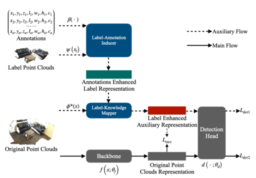

# Label-Guided Auxiliary Training Improves 3D Object Detector
This is the official implementation of LG3D (ECCV 2022), a simple and highly efficient auxiliary network for 3D object detection. For more details, please refer to:

**Label-Guided Auxiliary Training Improves 3D Object Detector**

## Introduction
In this
paper, we propose a Label-Guided auxiliary training method for 3D object detection (LG3D in short), which serves as an auxiliary network to enhance the feature learning of existing 3D object detectors. 
